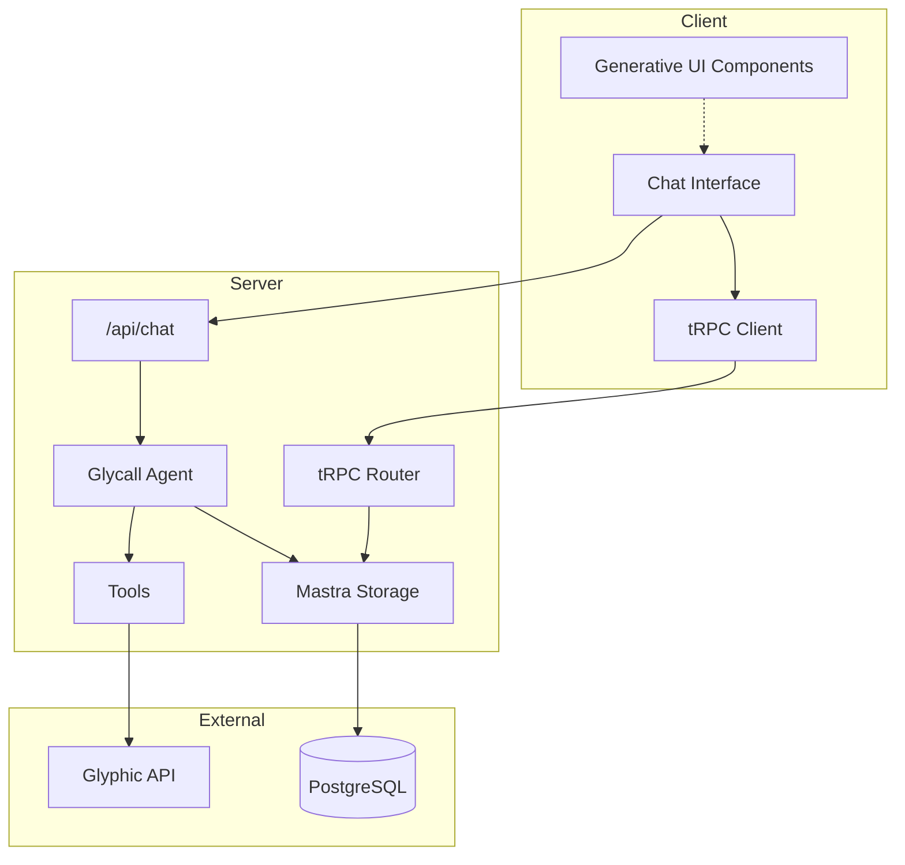

# Glycall

**AI-powered sales call assistant with Generative UI**

Glycall is a conversational AI assistant that helps sales teams search, analyze,
and explore their historical sales calls stored in
[Glyphic](https://glyphic.ai). Built with [Mastra](https://mastra.ai) and
Next.js, it features rich Generative UI components that display call data,
transcripts, and insights inline with chat responses.

---

## Features

- **Conversational Call Search** — Search calls by date range, participant
  email, or title using natural language
- **Generative UI** — Rich visual components (call cards, transcripts,
  participant lists) render inline with AI responses
- **Conversation Memory** — Persistent chat threads stored in PostgreSQL with
  full history recall
- **Smart Follow-ups** — Contextual suggestions after each response to guide
  exploration
- **Real-time Streaming** — Responses stream token-by-token with reasoning
  indicators
- **Thread Management** — Create, view, and delete conversation threads via
  sidebar

---

## Architecture

**Data Flow:**

1. User sends a message through the chat interface
2. The Mastra agent processes the request and calls relevant tools
3. Tools fetch data from Glyphic API (calls, transcripts, participants)
4. Display tools trigger Generative UI components in the response
5. Conversation is persisted to PostgreSQL for memory recall

---

## Tech Stack

| Category         | Technologies                            |
| ---------------- | --------------------------------------- |
| **Framework**    | Next.js 16, React 19, TypeScript 5      |
| **AI**           | Mastra Core, AI SDK (Vercel), Anthropic |
| **State**        | TanStack Query, tRPC                    |
| **Storage**      | PostgreSQL (via @mastra/pg)             |
| **Styling**      | Tailwind CSS 4, Radix UI, Motion        |
| **Code Quality** | Biome (lint + format)                   |

---

## Getting Started

### Prerequisites

- [Bun](https://bun.sh) (v1.0+) or Node.js (v20+)
- PostgreSQL database
- Glyphic API access

### Environment Variables

Create a `.env.local` file with the required variables:

- `ANTHROPIC_API_KEY` — Anthropic API key
- `GLYPHIC_API_KEY` — Glyphic API key
- `GLYPHIC_BASE_URL` — Glyphic API base URL
- `DATABASE_URL` — PostgreSQL connection string

### Installation

1. Clone the repository
2. Run `bun install` to install dependencies
3. Run `bun dev` to start the development server
4. Open [http://localhost:3000](http://localhost:3000)

---

## Key Components

### Glycall Agent

The agent is configured in `src/mastra/agents/glycall-agent.ts` with:

- **Instructions** for handling date-based searches, participant lookups, and
  transcript analysis
- **Data Tools** (`list-calls`, `get-call-info`) for fetching from Glyphic API
- **Display Tools** (`show-call-list`, `show-transcript`, etc.) that trigger
  Generative UI
- **Memory** for maintaining conversation context across messages

### Generative UI

Display tools return structured data that maps to React components. When the
agent calls a display tool like `show-call-list`, the corresponding UI component
renders the data inline with the chat response.

### Chat API

The streaming endpoint in `src/app/api/chat/route.ts` handles:

- Message streaming via `handleChatStream` from Mastra
- Memory persistence with thread/resource IDs
- Message recall via GET requests

---

## Scripts

| Command      | Description                   |
| ------------ | ----------------------------- |
| `bun dev`    | Start development server      |
| `bun build`  | Build for production          |
| `bun start`  | Start production server       |
| `bun lint`   | Run Biome linter              |
| `bun format` | Format code with Biome        |
| `bun gen`    | Regenerate Glyphic API client |

---

## License

MIT

---

Built by [Sheikh Uzair Hussain](https://linkedin.com/in/sheikhuzairhussain)
